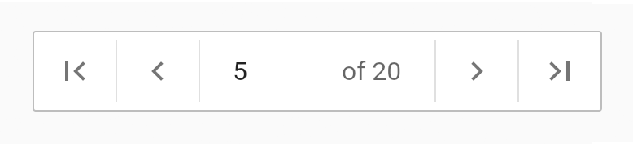
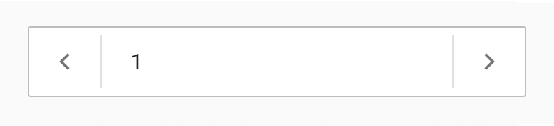

NumberSelector is a customizable widget designed for choosing an integer number by buttons or TextField.

## Features

- Increment and decrement buttons
- Skip to first and last page buttons
- Number TextField with safe parser

### Number selector with minimum and maximum value



### simple number selector




## Usage

```dart
    NumberSelector(
      current: 1,
      min: 1,
      max: 20,
      onUpdate: (number) {
        // Your magic here
      },
    ),
```
