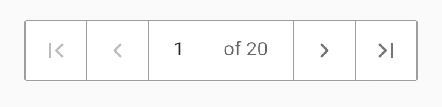

NumberSelector is a custom widget designed for choosing an integer number by buttons or textfield.

## Features

### Number selector with minimum and maximum value



### simple number selector


## Usage

```dart
    NumberSelector(
          start: 1,
          min: 1,
          max: 20,
          onNumberChange: (_) {},
        ),
```
